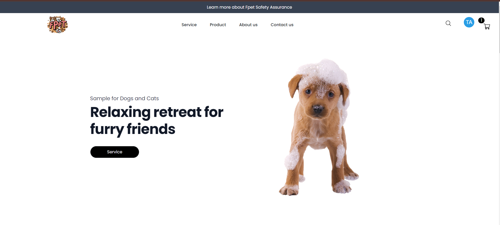

# 💫About Me :
FPetSpa - Pet's Spa Management  
FE: NodeJs, ReactJs, Tailwind  
BE: C#, Asp.Net API  

#Document:
SRS: (https://docs.google.com/document/d/1PnyjlA05YIpVyj3cdOvNwjMbUVC552Uq1i2aptHWwps/edit)  
MAPPING: (https://docs.google.com/spreadsheets/d/1f23OEP1Lm97303AvnM0e8KWX4jtA3F3aznOH1R-E2gU/edit?gid=1521139569#gid=1521139569)  

 --***Member***--
>> BE: Lê Văn Phước, Huy Ninh, Minh Hoàng, Phi Hùng  
>> FE: Lê Văn Tuấn Anh, Hải Sơn  
>> BA: Huy Ninh  

# 💻Tech Stack
              	
# 📊GitHub Stats :

---

----
# SPRINT - USECASE
| SPRINT | USECASE   |
|:--:|:------------:|
| 1 | UC-01, UC-02 ,UC-03, UC-05, UC-06, UC-11, UC-10	 |
| 2 |UC-09, 	UC-12,	UC-19,	UC-14,	UC-24	|
| 3 |UC-17, UC-18,	UC-04,	UC-13,	UC-20,	UC-21	 |
| 4 |UC-15, UC-16,	UC-23,	UC-07	UC-08,	UC-22	 |

# TASK FLOW
# --SPRINT 1--
| NAME | USECASE   |
|:--:|:------------:|
| Phước | UC-01, UC-03 |
| Hoàng | UC-03, UC-05, UC-11|
| H.Ninh| UC-06, UC-10 |
| Hùng |UC-01, UC-02, UC-06  |
| T.Anh (FE) |UC-01,UC-03, UC-05 |
| Sơn (FE)|UC-02,UC-05, UC-06,UC-11	 |
